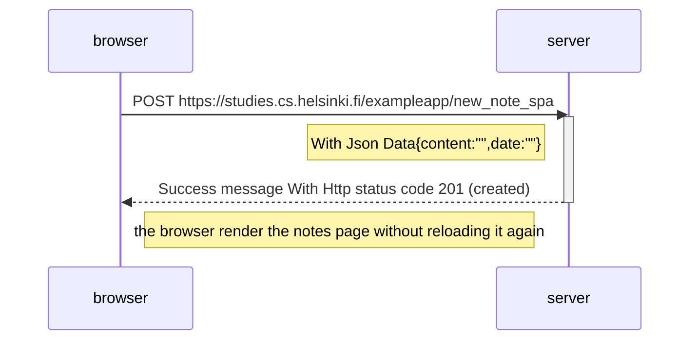

# Sequence Diagram For Submitting New Note In SPA(single-page-application)

```mermaid
sequenceDiagram
    participant browser
    participant server

    browser->>server: POST https://studies.cs.helsinki.fi/exampleapp/new_note_spa
    activate server
    Note left of server: With Json Data{content:"",date:""}
    
    server-->>browser: Success message With Http status code 201 (created)
    deactivate server
    Note right of browser: the browser render the notes page without reloading it again

```
