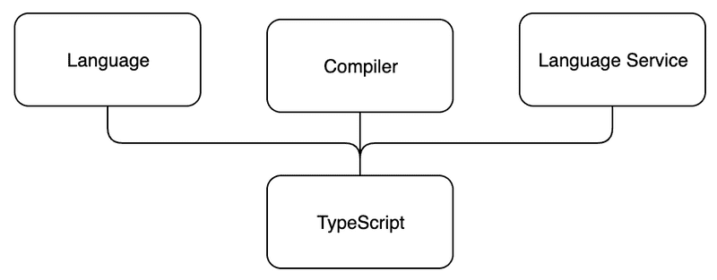

## TypeScript Notes

* This part is all about TypeScript: an open-source typed superset of JavaScript developed by Microsoft that compiles to plain JavaScript.
*  TypeScript offers features such as better development-time tooling, static code analysis, compile-time type checking and code-level documentation.
--- 
TypeScript consists of three separate, but mutually fulfilling parts:

  -  Language
  -  Compiler
  -  Language Service
  
  
  
---
1. The language consists of syntax, keywords and type annotations. The syntax is similar to but not the same as JavaScript syntax. From the three parts of TypeScript, programmers have the most direct contact with the language.
2. The compiler is responsible for type information erasure (i.e. removing the typing information) and for code transformations. The code transformations enable TypeScript code to be transpiled into executable JavaScript. Everything related to the types is removed at compile-time, so TypeScript isn't genuine statically typed code,The compiler also performs a static code analysis. It can emit warnings or errors if it finds a reason to do so.
3. The language service collects type information from the source code. Development tools can use the type information for providing intellisense, type hints and possible refactoring alternatives.

